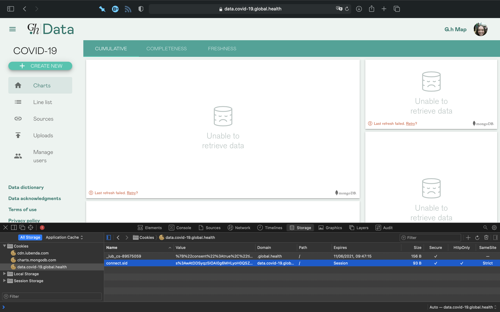
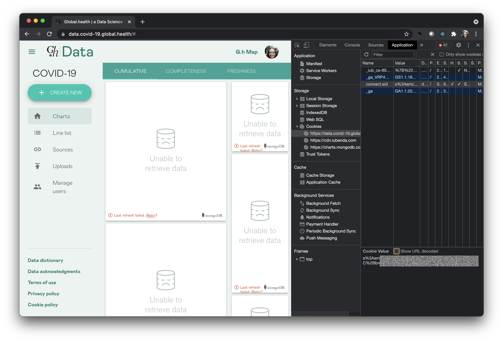
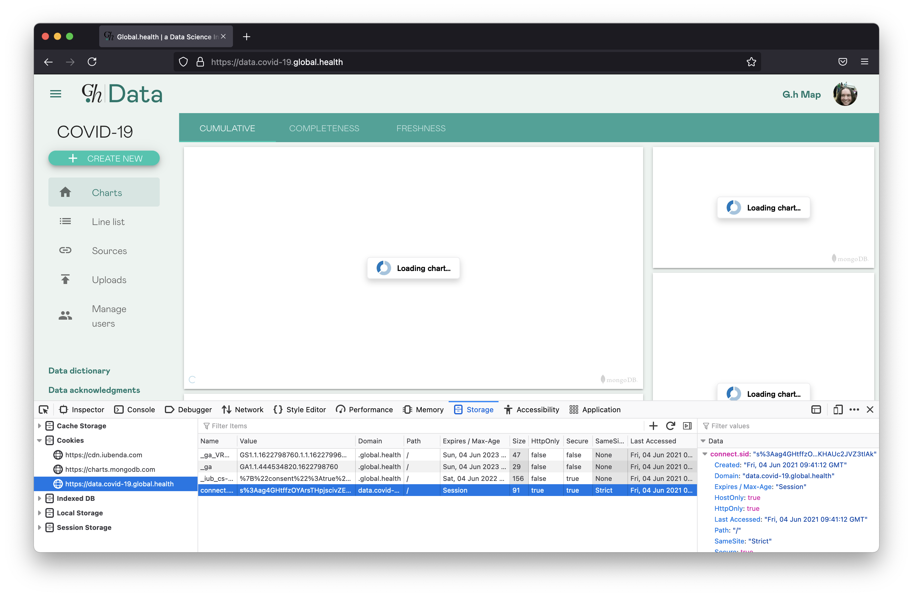

# Location Service

Handles geocoding of locations.

## So you want to geocode some locations

Well, you've come to the right place! You can do this in two ways: either locally, or using the location API in production.

### Local geocoding

The easiest thing to do is to run the development stack locally, then talk directly to the location service (bypassing all the access control stuff in the backend). You'll need to fill in the required environment variables [in `dev/.env`](../dev/README.md), particularly you need a mapbox API key in the `MAPBOX_TOKEN` field. You can get one from [Mapbox](https://docs.mapbox.com/help/getting-started/access-tokens/#how-access-tokens-work), it's free to create an account and generate a token.

Then from the top level run:

    dev/run_stack.sh

You can now talk to the location service on port 3003. Here's an example in Python using the `requests` package:

    >>> import requests
    >>> r = requests.get('http://localhost:3003/geocode/suggest?q=Addis%20Ababa')
    >>> r.status_code
    200
    >>> r.json()
    [{'country': 'Ethiopia', 'geoResolution': 'Admin3', 'geometry': {'latitude': 9.02722, 'longitude': 38.73694}, 'name': 'Addis Ababa, Ethiopia', 'place': ''}, {'country': 'United States', 'geoResolution': 'Point', 'geometry': {'latitude': 38.992624, 'longitude': -77.023968}, 'name': 'Addis Ababa, 8233 Fenton St, Silver Spring, Maryland 20910, United States', 'place': 'Addis Ababa'}, {'country': 'Australia', 'geoResolution': 'Point', 'geometry': {'latitude': -34.89941, 'longitude': 138.56229}, 'name': 'Addis Ababa Cafe, 462 Port Rd, Adelaide, South Australia 5007, Australia', 'place': 'Addis Ababa Cafe'}, {'country': 'United States', 'geoResolution': 'Point', 'geometry': {'latitude': 32.950039, 'longitude': -96.736455}, 'name': 'Addis Ababa, 100 S Central Expy, Richardson, Texas 75080, United States', 'place': 'Addis Ababa'}, {'country': 'United States', 'geoResolution': 'Point', 'geometry': {'latitude': 39.67582, 'longitude': -104.86596}, 'name': 'Addis Ababa, 2222 S Havana St, Aurora, Colorado 80014, United States', 'place': 'Addis Ababa'}]

Notice that you don't get all of the administrative levels filled in in the results. That's because doing so uses a premium Mapbox API that your local API key isn't enabled for. You can still use this method to test whether geocoding queries give results that are in the correct country, or otherwise match up to your expectations of the geographic distribution of your source data.

### Production geocoding

This is way more involved because you need to log in to the portal to get a session token, then copy that token into your script. Let's look at an example script first: it's a little more complex than the previous one.

    >>> import requests
    >>> s = requests.Session()
    >>> s.cookies['connect.sid']='A JUMBLE OF CHARACTERS'
    >>> r = s.get('https://data.covid-19.global.health/api/geocode/suggest?q=Addis%20Ababa')

The rest of this is instructions on how you get those characters into the cookie store.

First, go to [the production portal](https://data.covid-19.global.health) in your browser and log in. Then, in your browser, find the cookie inspector. In Safari, you need to go to Preferences, then Advanced, and tick "Show Develop menu in menu bar". Then go to Develop, Show Web Inspector. There's a Storage tab, and under there Cookies, and one of the cookies options is the `data.covid-19.global.health` domain, and there you see it:

In Chrome, log in to the portal, then right-click the page and choose "Inspect". Find the Application tab, and in there Storage, then Cookies, then the `data.covid-19.global.health` domain:

In Firefox, log in to the portal, then from the Tools menu choose Browser Tools, then Web Developer Tools. Find the Storage tab, then cookies, `https://data.covid-19.global.health`:

Copy the value of the `connect.sid` cookie into the `s.cookies['connect.sid']` line in your script.

If you get a response with status code 403 and this content:

    {'message': 'access is restricted to users with curator roles'}

your access token has expired and you need to go through the login flow in the browser again. There _is_ a token refresh flow but it isn't honestly going to be any easier to work with than just reauthenticating. We don't control the session lifetime because Google own that part of the flow, but it's empirically usually two hours.