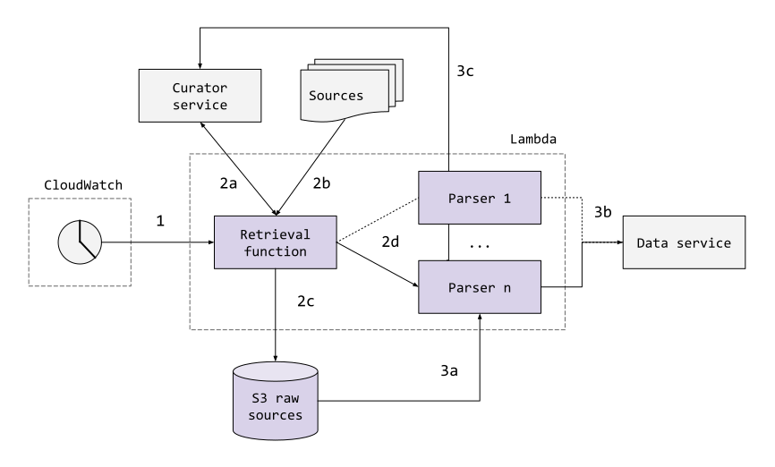

# Ingestion functions

## Overview

This directory contains AWS [Lambda functions](https://aws.amazon.com/lambda/)
used in the Global Health ingestion system.

The objective of the ingestion system is to facilitate a semi-automated
workflow accomplishing the retrieval of epidemiological source data, the
parsing thereof to the standard Global Health data format, and the persisting
of both raw content and parsed case records for use by the Global Health
community. For more information on Global Health, refer to the
[top-level README](https://github.com/globaldothealth/list/blob/main/README.md).

The structure of ingestion is roughly as shown below:



At a high-level:

1. **Actuation** is done by an AWS CloudWatch Events Scheduled Rule (one for
each source). The scheduled rule is defined, alongside the remainder of source
configuration, via the Global Health
[curator UI](../../verification/curator-service/ui/)
sources page.
2. **Retrieval** is performed by a single
[global retrieval function](./retrieval/retrieval.py),
which downloads (b) and persists (c) data in accordance with the source
configuration, retrieved from the
[curator API](../../verification/curator-service/api/)
(a).
3. **Parsing** is performed by custom, per-source
[parsing functions](./parsing/).
These are actuated directly by the global retrieval function (2d) (if specified
in the source configuration), and accomplish the conversion of raw source
content (3a) to the Global Health format. Converted data is written to the
central [data service](../../data-serving/data-service/) (for now, proxied via
the curator API, which offers an exposed, authenticated endpoint) (3b). While
there's no metadata currently written from parsing functions, the option is
available (3c).

## Development

### tl;dr

Ingestion functions are managed, developed, and deployed using the AWS
Serverless Application Model
([SAM](https://aws.amazon.com/serverless/sam/)). Functions are written in
Python and executed on a version 3.8 runtime. See set up instructions and
common commands, below.

### Setup for folks without AWS access

If you're a first-time contributor to the project and don't have access to the S3 bucket containing the service account keys, you can run the ingestion and parsing functions fully locally, in the `retrieval/valid_scheduled_event.json`, add this auth param to it:

```json
"auth": {
   "email": "local@ingestion.function"
}
```

This will make the functions log-in as a new user specified by this email and use the cookies generated for this user instead of the service account creds stored on S3.

Note that this only works in a local environment as the handler to register a user isn't exposed in production for obvious reasons.

Unfortunately there is no way to mount local volumes to store/retrieve source
contents instead of relying on S3 which means testing e2e locally isn't possible.
If you want to use another storage system for testing feel free to send a PR.

### One-time setup for people with AWS access

#### Prerequisites

1. Have valid AWS credentials configured in accordance with
[these instructions](https://docs.aws.amazon.com/serverless-application-model/latest/developerguide/serverless-getting-started-set-up-credentials.html).
1. Have Python 3.8 installed on your machine. To check what versions you have
installed, and to see which versions correspond to the `python` and `python3`
commands, run the following:

```shell
ls -l /usr/bin/python*
```

#### Setup

1. Install the AWS SAM CLI, following
[these instructions](https://docs.aws.amazon.com/serverless-application-model/latest/developerguide/serverless-sam-cli-install.html).
1. For each function you're planning to work with, be sure you have required
modules installed, e.g. via:

```shell
# In each parsing's subdir:
python3.8 -m pip install -r requirements.txt
# In the /ingestion/functions (necessary to run unit tests).
python3.8 -m pip install -r ci-requirements.txt
```

*NB:* Be sure you're using Python 3.8, which corresponds to the runtime of
the Lambda functions as configured in the [SAM template](./template.yaml). See
prerequisites, to check this.

You can validate changes to the SAM template by running `sam validate`.

### Writing and editing functions

For the most part, writing functions is writing standard Python business logic.
The primary caveat is that the business logic to be executed must be wrapped in
the Lambda handler API. Read more about that
[here](https://docs.aws.amazon.com/lambda/latest/dg/python-handler.html), or
more generally about Python Lambda development
[here](https://docs.aws.amazon.com/lambda/latest/dg/lambda-python.html).
The points at which the Lambda integration is most apparent are in testing and
execution of code.

You are free to write the parsers however you like.
It's best to get inspiration from existing functions though and the only prerequisite for it showing up in the UI once your PR is merged in is that its name must include _"ParsingFunction"_.

#### Unit tests

Unit testing is mostly standard `pytest`, with a caveat to be sure that tests
are run with the correct Python version. E.g.,

```shell
python3.8 -m pytest test/my_test.py
```

#### Manual local run

**IMPORTANT**: Local runs still require access to a service account hosted on s3. Follow #754 for updates on how to run functions with your own creds.

You need AWS sam CLi installed on your system, [follow the instructions](https://docs.aws.amazon.com/serverless-application-model/latest/developerguide/serverless-sam-cli-install.html) on their website to install it.

Run the stack locally using `/dev/run_stack.sh` and follow the [instructions](https://github.com/globaldothealth/list/blob/main/dev/README.md#permissions) to make sure you're an `admin` to be able to give the role account doing the fetch/parsing the right to call your local stack. This step is described below.

Go to the UI at http://localhost:3002/sources and add a new source for your parser, once you give it a name, a URL and save it, it will be given an ID.

Put that ID in the `retrieval/valid_scheduled_event.json` file.

Next invoke the `RetrievalFunction` like this:

```shell
sam build
sam local invoke "RetrievalFunction" -e retrieval/valid_scheduled_event.json --docker-network=host
```

If you get a 403 error, go to the [user administration page](http://localhost:3002/sources) and assign the `curator` and `reader` roles to the `ingestion@covid-19-map-277002.iam.gserviceaccount.com` service account there.

Upon success you'll see in the output something like
`{"bucket":"epid-sources-raw","key":"5f311a9795e338003016593a/2020/08/10/1009/content.csv"}`

In your parser package's `input_event.json` set the `s3Key` as `5f311a9795e338003016593a/2020/08/10/1009/content.csv` and the `sourceId` to `5f311a9795e338003016593a`. **Set values according to the output you got, do not copy-paste what's written in this document.**

Next you can invoke your parsing function:

```shell
sam local invoke "MyParsingFunction" -e my/dir/input_event.json --docker-network=host
```

Run this from the base `ingestion/functions` dir. The `MyParsingFunction` name should
correspond to the name of the resource as defined in the SAM `template.yaml`;
for more information on the template, read
[this article](https://docs.aws.amazon.com/serverless-application-model/latest/developerguide/sam-specification.html).

If all goes well you should see the number of cases created/updated (i.e. `{"count_created":4079,"count_updated":0}`).

Test via unit tests and manual testing prior to sending changes. A GitHub
action
[verifying the SAM build](../../.github/workflows/ingestion-aws-sam-build.yml)
is run on pull requests.

### Writing a parser

At minima, a parser must generate a list of cases that conform to the openAPI
specifications.

Its main function must yield cases one by one using [python generators](https://wiki.python.org/moin/Generators). A common library will take care of sending those cases to the server for you.

If you have a local stack running, go to the [OpenAPI UI](http://localhost:3001/api-docs) to check the structure of a `Case` object. Otherwise you can always [check it online](https://curator.ghdsi.org/api-docs/) as well.

For geocoding, the parser can either hardcode a location with latitude/longitude included, in which case no geocoding will be attempted on the server.
If it doesn't have that information it can output a `location.query` which will get geocoded by the server. If geocodes are to be restricted to a certain administrative area level, one can pass the `location.limitToResolution`. Details about those parameters are in the OpenAPI spec for the `NewCase` schema definition.

#### Debugging of parsers

When a parser is running locally via `sam local invoke`, you can access its container by listing the current docker containers with `docker container ps` and then you can inspect the container you want using its ID. This allows you to see which environment variables are set and is useful to debug potential memory exceeded errors or dangling parsers that are waiting to timeout for some obscure reason. Some useful debugging commands include `docker logs <container id>`, `docker container inspect <container id>` and `docker container stats <container id>`.

For live parsers, you can look in the [AWS console](https://console.aws.amazon.com/lambda/home?region=us-east-1#/functions) directly, all `print()` calls are logged to Cloudwatch which is useful for debugging.

### Deployment

Deployment is accomplished automatically via a dedicated
[GitHub action](../../.github/workflows/ingestion-aws-sam-deploy.yml). If
there's a need to deploy directly, run:

```shell
sam build
sam deploy
```

From the base `ingestion/functions` dir. The deployment configuration will be
inferred from the `samconfig.toml` file. Follow the confirmation dialogues.

### Writing a parser where deduplication of patients cannot be done

Some sources do not provide a unique ID for each case allowing us to update existing cases in subsequent parsing runs.

To accomodate for that, here is the procedure to write a parser that only imports data that is three days old (a reasonable threshold chosen arbitrarily, feel free to tune it according to your source's freshness):

1. write the parser, it must produces all cases for its input source, the `parsing/common/parsing_lib.py` library will ensure no duplicates are entered if you follow the next steps
2. edit your source in the curator portal UI: set the date filter to only fetch data up to 3 days ago
3. run the parser once to import all the data up to 3 days before today
   1. Follow [this issue](https://github.com/globaldothealth/list/issues/781] for how to do this from the UI, in the meantime run the parser locally as described in this document.
4. edit the source again to only fetch data up to 3 days ago
5. set the daily cron expression in your source and have the parser run every day

That parser will now import a day worth of data with a lag of 3 days, this delay is deemed is acceptable given the inability to dedupe cases.

### Handling sources with unstable URLs

If a source has a time-based URL scheme you can use the following date formatting directives in the source URL and those will be automatically applied when retrieving the source content:

- `$FULLYEAR` is replaced with the 4 digits current year.
- `$FULLMONTH` is replaced with the 2 digits current month.
- `$FULLDAY` is replaced with the 2 digits current day of the month.
- `$MONTH` is replaced with the 1 or 2 digits current month.
- `$DAY` is replaced with the 1 or 2 digits current day of the month.

For example if a source publishes its data every day at a URL like `https://source.com/data/year-month-day.json` you can set the source URL to `https://source.com/data/$FULLYEAR-$FULLMONTH-$FULLDAY.json` and it will fetch the URL `https://source.com/data/2020-04-20.json` on the 4th of April 2020.

### Encoding of sources

When the retrieval function stores the contents of a source in S3, the data is automatically encoded in utf-8 so that parsers do not have to care about which
encoding to use when reading the files.

## Parsers

You can find a list of issues/FR for parsers using the [importer tag](https://github.com/globaldothealth/list/issues?q=is%3Aopen+is%3Aissue+label%3AImporter).

Here is an overview of parsers written so far and some details about the data they collect.

| Parser                      | Code                                                                                            | Remarks                                                                                                                                                                                                                                                                                             | FR   |
|-----------------------------|-------------------------------------------------------------------------------------------------|-----------------------------------------------------------------------------------------------------------------------------------------------------------------------------------------------------------------------------------------------------------------------------------------------------|------|
| India                       | [code](https://github.com/globaldothealth/list/tree/main/ingestion/functions/parsing/india)     | We aren't converting all fields yet. We're restricting ourselves to data with an `agebracket` present. This data has an interesting format in which some rows represent aggregate data. We need to add handling logic; until we've done so, this filter is used to process strictly line list data. | #563 |
| Switzerland (Zurich canton) | [code](https://github.com/globaldothealth/list/tree/main/ingestion/functions/parsing/ch_zurich) | Only imports confirmed cases, not confirmed deaths as we can't link one to the other (no unique patient ID provided)                                                                                                                                                                                | #483 |
| Thailand                    | [code](https://github.com/globaldothealth/list/tree/main/ingestion/functions/parsing/thai)      |                                                                                                                                                                                                                                                                                                     | #516 |
| Hong Kong                   | [code](https://github.com/globaldothealth/list/tree/main/ingestion/functions/parsing/hongkong)  |                                                                                                                                                                                                                                                                                                     | #518 |
| Japan                       | [code](https://github.com/globaldothealth/list/tree/main/ingestion/functions/parsing/japan)     |                                                                                                                                                                                                                                                                                                     | #481 |
| Estonia                     | [code](https://github.com/globaldothealth/list/tree/main/ingestion/functions/parsing/estonia)   |                                                                                                                                                                                                                                                                                                     | #502 |