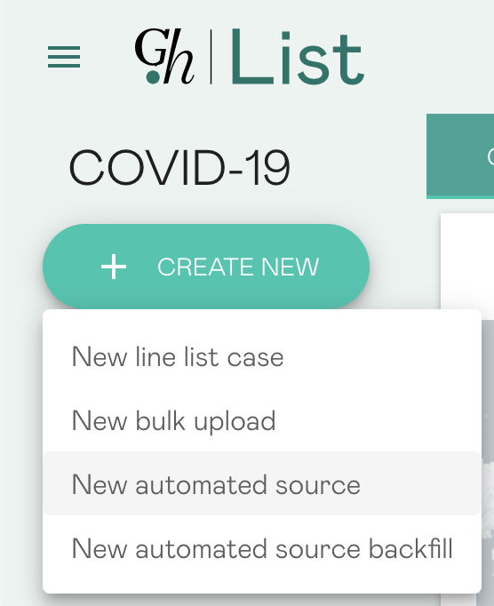
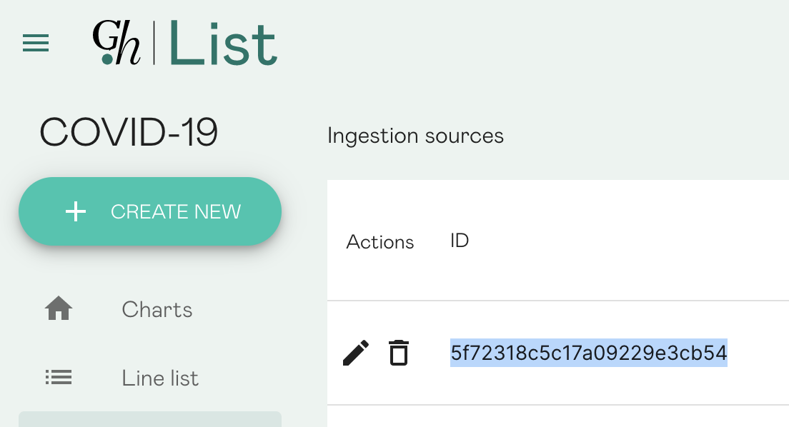

# Ingestion functions

## Overview

This directory contains AWS [Lambda functions](https://aws.amazon.com/lambda/)
used in the Global Health ingestion system.

The objective of the ingestion system is to facilitate a semi-automated
workflow accomplishing the retrieval of epidemiological source data, the
parsing thereof to the standard Global Health data format, and the persisting
of both raw content and parsed case records for use by the Global Health
community. For more information on Global Health, refer to the
[top-level README](https://github.com/globaldothealth/list/blob/main/README.md).

The structure of ingestion is roughly as shown below:


At a high-level:

1. **Actuation** is done by an AWS CloudWatch Events Scheduled Rule (one for
each source). The scheduled rule is defined, alongside the remainder of source
configuration, via the Global Health
[curator UI](../../verification/curator-service/ui/)
sources page.
2. **Retrieval** is performed by a single
[global retrieval function](./retrieval/retrieval.py),
which downloads (b) and persists (c) data in accordance with the source
configuration, retrieved from the
[curator API](../../verification/curator-service/api/)
(a).
3. **Parsing** is performed by custom, per-source
[parsing functions](./parsing/).
These are actuated directly by the global retrieval function (2d) (if specified
in the source configuration), and accomplish the conversion of raw source
content (3a) to the Global Health format. Converted data is written to the
central [data service](../../data-serving/data-service/) (for now, proxied via
the curator API, which offers an exposed, authenticated endpoint) (3b). While
there's no metadata currently written from parsing functions, the option is
available (3c).

## Development

### tl;dr

Ingestion functions are managed, developed, and deployed using the AWS
Serverless Application Model
([SAM](https://aws.amazon.com/serverless/sam/)). Functions are written in
Python and executed on a version 3.8 runtime. See set up instructions and
common commands, below.

If you are using VSCode you can find [common settings](https://github.com/globaldothealth/list/blob/main/dev/.vscode/settings.json) around linting/style. The [CI pipeline](https://github.com/globaldothealth/list/blob/main/.github/workflows/ingestion-functions-python.yml) runs flake8 so make sure you at least have this running in your editor.

You can find more information on linting in visual studio [here](https://code.visualstudio.com/docs/python/linting).

### Setup for folks without AWS access

If you're a first-time contributor to the project and don't have access to the S3 bucket containing the service account keys, you can run the ingestion and parsing functions fully locally, in the `retrieval/valid_scheduled_event.json`, add this auth param to it:

```json
"auth": {
   "email": "local@ingestion.function"
}
```

This will make the functions log-in as a new user specified by this email and use the cookies generated for this user instead of the service account creds stored on S3.

Note that this only works in a local environment as the handler to register a user isn't exposed in production for obvious reasons.

Unfortunately there is no way to mount local volumes to store/retrieve source
contents instead of relying on S3 which means testing e2e locally isn't possible.
If you want to use another storage system for testing feel free to send a PR.

### One-time setup for people with AWS access

#### Prerequisites

1. Have valid AWS credentials configured in accordance with
[these instructions](https://docs.aws.amazon.com/serverless-application-model/latest/developerguide/serverless-getting-started-set-up-credentials.html).
1. Have Python 3.8 installed on your machine. To check what versions you have
installed, and to see which versions correspond to the `python` and `python3`
commands, run the following:

```shell
ls -l /usr/bin/python*
```

#### Setup

1. Install the AWS SAM CLI, following
[these instructions](https://docs.aws.amazon.com/serverless-application-model/latest/developerguide/serverless-sam-cli-install.html).
1. For each function you're planning to work with, be sure you have required
modules installed, e.g. via:

```shell
# In each parsing's subdir:
python3.8 -m pip install -r requirements.txt
# In the /ingestion/functions (necessary to run unit tests).
python3.8 -m pip install -r ci-requirements.txt
```

*NB:* Be sure you're using Python 3.8, which corresponds to the runtime of
the Lambda functions as configured in the [SAM template](./template.yaml). See
prerequisites, to check this.

You can validate changes to the SAM template by running `sam validate`.

### Writing and editing functions

For the most part, writing functions is writing standard Python business logic.
The primary caveat is that the business logic to be executed must be wrapped in
the Lambda handler API. Read more about that
[here](https://docs.aws.amazon.com/lambda/latest/dg/python-handler.html), or
more generally about Python Lambda development
[here](https://docs.aws.amazon.com/lambda/latest/dg/lambda-python.html).
The points at which the Lambda integration is most apparent are in testing and
execution of code.

You are free to write the parsers however you like.
It's best to get inspiration from existing functions though and the only prerequisite for it showing up in the UI once your PR is merged in is that its name must include _"ParsingFunction"_.

### Writing a parser

You can find an example minimal parser in the [parsing/example](/ingestion/functions/parsing/example/README.md) directory, let's look at its structure:

```shell
$ tree parsing/example
parsing/example
├── README.md        # You can document your parser if you want.
├── __init__.py      # Required to make this a proper python package, usually empty.
├── example.py       # Write your parsing code here.
├── example_test.py  # Always add unit tests.
├── input_event.json # AWS Cloudwatch event used when testing locally, will be described below.
├── requirements.txt # Any special third-party dependency that your parser requires, this file is required even if it's empty.
└── sample_data.csv  # Some sample data used in unit tests, usually copied verbatim from a real source.
```

At minima, a parser must generate a list of cases that conform to the openAPI
specifications. If you have a local stack running, go to the [OpenAPI UI](http://localhost:3001/api-docs) to check the structure of a `Case` object. Otherwise you can always [check it online](https://curator.ghdsi.org/api-docs/) as well.

A minimal case looks like this:

```text
{
    "caseReference": {
        "sourceId": "5ea86423bae6982635d2e1f8",
        "sourceUrl": "cdc.gov"
    },
    "events": [
        {
            "name": "confirmed",
            "dateRange": {
                "start": "04/27/2020Z",
                "end": "04/27/2020Z"
            }
        }
    ],
    "location": {
        "query": "Canada",
    },
}
```

Its main function (usually called `parse_cases`) must yield cases one by one using [python generators](https://wiki.python.org/moin/Generators). A common library will take care of sending those cases to the server for you in batches.

For geocoding, the parser can either hardcode a location with a `name`, `geoResolution` and `geometry.latitude`, `geometry.longitude` included, in which case no geocoding will be attempted on the server.
If it doesn't have that information it can simply output a `location.query` which will get geocoded by the server. If geocodes are to be restricted to a certain administrative area level, one can pass the `location.limitToResolution`. Details about those parameters are in the OpenAPI spec for the `NewCase` schema definition.

Example of a location which will not trigger geocoding on the server:

```json
{
   "country": "Switzerland",
   "administrativeAreaLevel1": "Zurich",
   "geoResolution": "Admin1",
   "name": "Zurich canton",
   "geometry": {
         "longitude": "8.651071",
         "latitude": "47.42568",
   }
}
```

Example if a minimal location which will trigger geocoding:

```json
{
   "query": "Quebec, Canada"
}
```

Example of a location which will trigger geocoding with restricted results:

```json
{
   "query": "Quebec, Canada",
   "limitToResolution": "Admin1,Country"
}
```

Travel history locations can be geocoded in the same way, travel history should only contain travels prior to the case's location.

Prefer sending queries that go from smallest to biggest regions as mapbox can get confused by the former and geocode to a totally different country that the one you were expecting.

Fields and nested structs should be preferably not set (or set to `None`) rather than set to an empty value (for example unknown age shouldn't be set to `''` and unknown demographics altogether shouldn't be set to `{}`).

Once you are done writing the parser, it needs to be included in the [SAM template](/ingestion/functions/template.yaml) to be made available in production, you can refer to how other functions were added there for example:

```yaml
# This name must contain "ParsingFunction" in it as a convention.
ExampleParsingFunction:
    Type: AWS::Serverless::Function
    Properties:
        # This is the package in which you wrote your parsing code.
        CodeUri: parsing/example/
        # This is the handler in your package in format: file_name.function_name
        Handler: example.lambda_handler
        Description: Example parser
        # This is required for running in AWS.
        Policies:
        - AWSLambdaBasicExecutionRole
        - AWSLambdaReadOnlyAccess
        # Adjust this based on your memory requirements (local runs prints the max memory usage at the end of the run, it's usually good to check if the allocated memory is enough especially for parsers that cannot parse cases one by one (like some JSON parsers which hold the whole data set in memory).
        MemorySize: 512
        # This is required to access the common code layer for parsers.
        Layers:
        - !Ref ParsingLibLayer
```

#### Unit tests

Unit testing is mostly standard `pytest`, with a caveat to be sure that tests
are run with the correct Python version. E.g.,

```shell
python3.8 -m pytest test/my_test.py
```

#### Manual local run

**IMPORTANT**: Local runs still require access to a service account hosted on s3. Follow #754 for updates on how to run functions with your own creds.

You need AWS sam CLi installed on your system, [follow the instructions](https://docs.aws.amazon.com/serverless-application-model/latest/developerguide/serverless-sam-cli-install.html) on their website to install it.

Run the stack locally using `/dev/run_stack.sh` and follow the [instructions](https://github.com/globaldothealth/list/blob/main/dev/README.md#permissions) to make sure you're an `admin` to be able to give the role account doing the fetch/parsing the right to call your local stack. This step is described below.

Go to the [UI](http://localhost:3002/sources) and add a new source for your parser by clicking on `CREATE NEW` -> `New automated source`.

.

Once you give it a name, a URL and save it, it will be given an ID.



Put that ID in the [retrieval/valid_scheduled_event.json](/ingestion/functions/retrieval/valid_scheduled_event.json) file, it should now look something like:

```json
{
    "env": "local",
    "sourceId": "<paste the source ID here>",
    "auth": {
      "email": "local@ingestion.function"
    }
}
```

Next invoke the `RetrievalFunction` like this:

```shell
cd ingestion/functions
sam build
sam local invoke "RetrievalFunction" -e retrieval/valid_scheduled_event.json --docker-network=host
```

If you get a 403 error, go to the [user administration page](http://localhost:3002/users) and assign the `curator` role to the `ingestion@covid-19-map-277002.iam.gserviceaccount.com` service account there or just make sure you added the "auth" property to the event as described in the [auth section](#setup-for-folks-without-aws-access)

Upon success you'll see in the output something like
`{"bucket":"epid-sources-raw","key":"5f311a9795e338003016593a/2020/08/10/1009/content.csv"}`

In your parser package's `input_event.json` set the `s3Key` as `5f311a9795e338003016593a/2020/08/10/1009/content.csv` and the `sourceId` to `5f311a9795e338003016593a`. **Set values according to the output you got, do not copy-paste what's written in this document.**

Next you can invoke your parsing function:

```shell
sam local invoke "MyParsingFunction" -e my/dir/input_event.json --docker-network=host
```

Run this from the base `ingestion/functions` dir. The `MyParsingFunction` name should
correspond to the name of the resource as defined in the SAM `template.yaml`;
for more information on the template, read
[this article](https://docs.aws.amazon.com/serverless-application-model/latest/developerguide/sam-specification.html).

If all goes well you should see the number of cases created/updated (i.e. `{"count_created":4079,"count_updated":0}`).

Test via [unit tests](#Unit-tests) prior to sending PRs. A GitHub
action
[verifying the SAM build](../../.github/workflows/ingestion-aws-sam-build.yml)
is run on pull requests.

#### Debugging of parsers

When a parser is running locally via `sam local invoke`, you can access its container by listing the current docker containers with `docker container ps` and then you can inspect the container you want using its ID. This allows you to see which environment variables are set and is useful to debug potential memory exceeded errors or dangling parsers that are waiting to timeout for some obscure reason. Some useful debugging commands include `docker logs <container id>`, `docker container inspect <container id>` and `docker container stats <container id>`.

For live parsers, you can look in the [AWS console](https://console.aws.amazon.com/lambda/home?region=us-east-1#/functions) directly, all `print()` calls are logged to Cloudwatch which is useful for debugging.

Example live debugging workflow:

1. [Check the Curator portal for errors](https://curator.ghdsi.org/uploads). In this example, I'll use the error in the Mexico parser from 2020-10-20.
2. Use the AWS console to find the logs. I'm doing this in the command line, so `aws logs describe-log-groups` shows the log groups. Only one of them has "Mexico" in the name, so that's the one I want.
3. `aws logs describe-log-streams --log-group-name {GROUP_NAME}` shows me the log stream names, conveniently ordered by date as it's the latest (the last in the list) that I want. They also are named after the date, if you're searching for a particular run.
4. `aws logs get-log-events --log-group-name {GROUP_NAME} --log-stream-name '{STREAM_NAME}'` shows the log events. Notice that the stream name is in single quotes to avoid shell expansion of its name.
5. Read the logs, identify the error.
6. Fix the error.
7. Submit pull request.

Steps 5-6 may take longer than indicated.

### Deployment

Deployment is accomplished automatically via a dedicated
[GitHub action](../../.github/workflows/ingestion-aws-sam-deploy.yml). If
there's a need to deploy directly, run:

```shell
sam build
sam deploy
```

From the base `ingestion/functions` dir. The deployment configuration will be
inferred from the `samconfig.toml` file. Follow the confirmation dialogues.

### Writing a parser where deduplication of patients cannot be done

Some sources do not provide a unique ID for each case allowing us to update existing cases in subsequent parsing runs.

To accomodate for that, here is the procedure to write a parser that only imports data that is three days old (a reasonable threshold chosen arbitrarily, feel free to tune it according to your source's freshness):

1. write the parser, it must produces all cases for its input source, the `parsing/common/parsing_lib.py` library will ensure no duplicates are entered if you follow the next steps
2. edit your source in the curator portal UI: set the date filter to only fetch data up to 3 days ago
3. run the parser once to import all the data up to 3 days before today
4. edit the source again to only fetch data up to 3 days ago
5. set the AWS Schedule Expression for your source and have the parser run every day

That parser will now import a day worth of data with a lag of 3 days, this delay is deemed is acceptable given the inability to dedupe cases.

### Handling sources with unstable URLs

If a source has a time-based URL scheme you can use the following date formatting directives in the source URL and those will be automatically applied when retrieving the source content:

- `$FULLYEAR` is replaced with the 4 digits current year.
- `$FULLMONTH` is replaced with the 2 digits current month.
- `$FULLDAY` is replaced with the 2 digits current day of the month.
- `$MONTH` is replaced with the 1 or 2 digits current month.
- `$DAY` is replaced with the 1 or 2 digits current day of the month.

For example if a source publishes its data every day at a URL like `https://source.com/data/year-month-day.json` you can set the source URL to `https://source.com/data/$FULLYEAR-$FULLMONTH-$FULLDAY.json` and it will fetch the URL `https://source.com/data/2020-04-20.json` on the 4th of April 2020.

### Compressed sources

Some sources are provided as [zip files](https://en.wikipedia.org/wiki/Zip_(file_format)). Those are supported by the retrieval function assuming it contains a single file in the archive containing the line list data, it will extract that single file and the parsing functions will have access to it so you can write a parser without caring about the zip file at all.

If you need other archive or compression formats supported please [file an issue in this repository](https://github.com/globaldothealth/list/issues/new?assignees=&labels=Importer&template=feature_request.md&title=Additional%20compression%20support) indicating the type of support needed, thank you.

### Encoding of sources

When the retrieval function stores the contents of a source in S3, the data is automatically encoded in utf-8 so that parsers do not have to care about which
encoding to use when reading the files.

## Parsers

You can find a list of issues/FR for parsers using the [importer tag](https://github.com/globaldothealth/list/issues?q=is%3Aopen+is%3Aissue+label%3AImporter).

Here is an overview of parsers written so far and some details about the data they collect.

_Please update this table with new parsers, or pertinent changes._

| Parser                      | Code                                                                                                 | UUID/Deduping | Remarks                                                                                                                                                                                                                                                                                             | FR   |
|-----------------------------|------------------------------------------------------------------------------------------------------|---------------|-----------------------------------------------------------------------------------------------------------------------------------------------------------------------------------------------------------------------------------------------------------------------------------------------------|------|
| India                       | [code](https://github.com/globaldothealth/list/tree/main/ingestion/functions/parsing/india)          |       Y       | Only processes line list style data from this source. There's bulk "state of the world" data published with current values (e.g. number currently hospitalized on a given date), but it's purely aggregate/can't be disaggregated to our format..                                                   | #563 |
| Switzerland (Zurich canton) | [code](https://github.com/globaldothealth/list/tree/main/ingestion/functions/parsing/ch_zurich)      |       N       | Only imports confirmed cases, not confirmed deaths as we can't link one to the other (no unique patient ID provided). Granularity for cases is weekly, not daily so we use the first day of the given week arbitrarily.                                                                             | #483 |
| Thailand                    | [code](https://github.com/globaldothealth/list/tree/main/ingestion/functions/parsing/thailand)           |       Y       |                                                                                                                                                                                                                                                                                                     | #516 |
| Hong Kong                   | [code](https://github.com/globaldothealth/list/tree/main/ingestion/functions/parsing/hongkong)       |       Y       |                                                                                                                                                                                                                                                                                                     | #518 |
| Japan                       | [code](https://github.com/globaldothealth/list/tree/main/ingestion/functions/parsing/japan)          |       Y       |                                                                                                                                                                                                                                                                                                     | #481 |
| Estonia                     | [code](https://github.com/globaldothealth/list/tree/main/ingestion/functions/parsing/estonia)        |       Y       |                                                                                                                                                                                                                                                                                                     | #502 |
| Amapa, Brazil               | [code](https://github.com/globaldothealth/list/tree/main/ingestion/functions/parsing/brazil_amapa)   |       N       | There are two files in the source for Amapa, one for confirmed cases and one for confirmed deaths; some of these cases may also be deaths but without patient IDs we are unable to confirm.                                                                                                         | #495 |
| Paraiba, Brazil             | [code](https://github.com/globaldothealth/list/tree/main/ingestion/functions/parsing/brazil_paraiba) |       Y       |                                                                                                                                                                                                                                                                                                     | #499 |
| Peru                        | [code](https://github.com/globaldothealth/list/tree/main/ingestion/functions/parsing/peru)           |       Y       | Assuming PR = prueba rapida (rapid serological test) and PCR = PCR test                                                                                                                                                                                                                             | #484 |
| Taiwan                      | [code](https://github.com/globaldothealth/list/tree/main/ingestion/functions/parsing/taiwan)         |       N       |                                                                                                                                                                                                                                                                                                     | #517 |
| Colombia                    | [code](https://github.com/globaldothealth/list/tree/main/ingestion/functions/parsing/colombia)       |       Y       | Assuming the date confirmed is the date of diagnosis (Fecha diagnostico) rather than Fecha de notificación (generally several days earlier). When date of diagnosis, using date reported online as proxy. Tipo recuperación refers to how they decided the patient had recovered: either by 21 days elapsing since symptoms, or a negative PCR/antigen test. No dates for travel history, only distinction is between cases of type: 'Importado' vs. 'Relacionado'. | #504 |
| Germany                     | [code](https://github.com/globaldothealth/list/tree/main/ingestion/functions/parsing/germany)        |       N       |                                                                                                                                                                                                                                                                                                     | #482 |
| Distrito Federal, Brazil    | [code](https://github.com/globaldothealth/list/tree/main/ingestion/functions/parsing/brazil_distrito_federal) | N    |                                                                                                                                                                                                                                                                                                     | #498 |
| Argentina                    | [code](https://github.com/globaldothealth/list/tree/main/ingestion/functions/parsing/argentina)       |       Y       | We are currently only incorporating cases classified ('clasificacion_resumen') as 'Confirmed'. However, 970k out of 1.5M cases are listed as 'Discarded', even though many have data values resembling confirmed Covid-19 patients, eg date_of_diagnosis, ICU_admission, mechanical breathing assistance. Future versions may want to modify this behaviour. For cases classified as Confirmed but lacking a Date of Diagnosis, we use Date of Symptom onset where present, and Date of Case Opening where neither Date of Diagnosis or Date of Symptom Onset are present. For case location, we use 'Province of case loading' (carga_provincia_nombre). This is where the laboratory tests were carried out, so may not always correspond to the exact location of the case, but is best proxy we have. The other location date refers to the residential address of the patient.| #508 |
| Goias, Brazil                    | [code](https://github.com/globaldothealth/list/tree/main/ingestion/functions/parsing/brazil_goias)       |       N       |                                                                                                                                                                                                                                                                                                     | #489 |
| Cuba                    | [code](https://github.com/globaldothealth/list/tree/main/ingestion/functions/parsing/cuba)       |       Y       | Nationality of case is provided in two letter country codes, so using pycountry package to parse these. The field 'posible_procedencia_contagio' is generally populated by two letter country codes. Case is assumed to have travelled from one of these countries in last 30 days if populated. Diagnostic centre and treatment hospital are both included in notes for now, could be geocoded in future. Currently no parsing of symptoms, as field is always left empty - worth rechecking this in future in case this field becomes populated. No disease outcome data is provided either.| #513 |
| Mexico                    | [code](https://github.com/globaldothealth/list/tree/main/ingestion/functions/parsing/mexico)       |       N       | | #480 |
| Rio Grande do Sul, Brazil                    | [code](https://github.com/globaldothealth/list/tree/main/ingestion/functions/parsing/riograndedosul)       |       N       | | #490 |
| Sao Paolo, Brazil                    | [code](https://github.com/globaldothealth/list/tree/main/ingestion/functions/parsing/saopaolo)       |       N       |Some caveats: 1. There are no patient ID/case ID in the raw API so we aren't able to dedupe. 2. We can't link confirmed cases and confirmed deaths because of (1) so we're only importing confirmed cases and ignoring deaths. | #497 |
| USA                    | [code](https://github.com/globaldothealth/list/tree/main/ingestion/functions/parsing/USA)       |       N       | | #1349 |
| Acre, Brazil                    | [code](https://github.com/globaldothealth/list/tree/main/ingestion/functions/parsing/brazil_acre)       |       N       || #494 |
| Ceara, Brazil                    | [code](https://github.com/globaldothealth/list/tree/main/ingestion/functions/parsing/brazil_ceara)       |       Y       || #491 |
| Espirito Santo, Brazil                    | [code](https://github.com/globaldothealth/list/tree/main/ingestion/functions/parsing/brazil_espirito_santo)       |       N       || #492 |
| Para, Brazil                    | [code](https://github.com/globaldothealth/list/tree/main/ingestion/functions/parsing/brazil_para)       |       Y       || #500 |
| Rio de Janeiro, Brazil                    | [code](https://github.com/globaldothealth/list/tree/main/ingestion/functions/parsing/brazil_rio_de_janeiro)       |       N       |Only include cases which include a 'dt_evento' as confirmed date field. This loses ~400 cases out of 350k. Using residential municipality ('municipio_res') as case location, as its the only location field other than 'bairro' (neighborhood), which is missing in ~2/5 cases and cannot be easily geocoded with mapbox.| #501 |
| Canada                    | [code](https://github.com/globaldothealth/list/tree/main/ingestion/functions/parsing/canada)       |       Y       || #485 |
| Czechia                    | [code](https://github.com/globaldothealth/list/tree/main/ingestion/functions/parsing/czechia)       |       N       || #507 |
| Paraguay                    | [code](https://github.com/globaldothealth/list/tree/main/ingestion/functions/parsing/paraguay)       |       Y       || #514 |
| South Africa                    | [code](https://github.com/globaldothealth/list/tree/main/ingestion/functions/parsing/south_africa)       |       Y       |Please note that this data was last updated in May 2020. This parser only deals with the columns where there was any data at the time of writing. Several columns with potentially useful information (e.g. date_onset_symptoms) are unpopulated for all cases. Would be worth keeping an eye on the data to see whether (a) it starts getting updated again and (b) whether this will lead to any new information provided at which point the parser will need to be expanded to deal with this.| #487 |