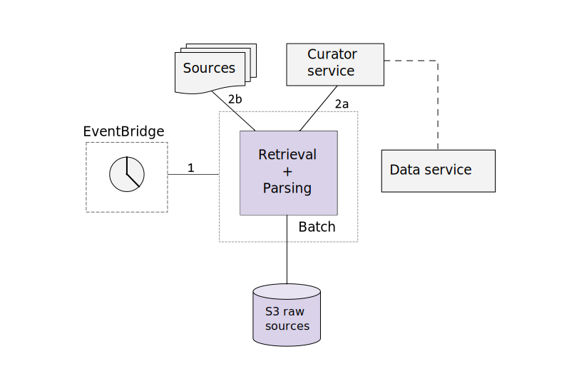

# Ingestion functions

## Overview

This directory contains AWS [Lambda functions](https://aws.amazon.com/lambda/)
used in the Global Health ingestion system.

The objective of the ingestion system is to facilitate a semi-automated
workflow accomplishing the retrieval of epidemiological source data, the
parsing thereof to the standard Global Health data format, and the persisting
of both raw content and parsed case records for use by the Global Health
community. For more information on Global Health, refer to the
[top-level README](https://github.com/globaldothealth/list/blob/main/README.md).

The structure of ingestion is roughly as shown below:



At a high-level:

1. **Actuation** is done by an AWS CloudWatch Events Scheduled Rule (one for
each source). The scheduled rule is defined, alongside the remainder of source
configuration, via the Global Health
[curator UI](../../verification/curator-service/ui/)
sources page.
2. **Retrieval** is performed by a single
[global retrieval function](./retrieval/retrieval.py),
which downloads (b) and persists (c) data in accordance with the source
configuration, retrieved from the
[curator API](../../verification/curator-service/api/)
(a).
3. **Parsing** is performed by custom, per-source
[parsing functions](./parsing/).
These are actuated directly by the global retrieval function (2d) (if specified
in the source configuration), and accomplish the conversion of raw source
content (3a) to the Global Health format. Converted data is written to the
central [data service](../../data-serving/data-service/) (for now, proxied via
the curator API, which offers an exposed, authenticated endpoint) (3b). While
there's no metadata currently written from parsing functions, the option is
available (3c).

## Development

### tl;dr

Ingestion functions are managed, developed, and deployed using the AWS
Serverless Application Model
([SAM](https://aws.amazon.com/serverless/sam/)). Functions are written in
Python and executed on a version 3.6 runtime. See set up instructions and
common commands, below.

### One-time setup

#### Prerequisites

1. Have valid AWS credentials configured in accordance with
[these instructions](https://docs.aws.amazon.com/serverless-application-model/latest/developerguide/serverless-getting-started-set-up-credentials.html).
1. Have Python 3.6 installed on your machine. To check what versions you have
installed, and to see which versions correspond to the `python` and `python3`
commands, run the following:

```shell
ls -l /usr/bin/python*
```

#### Setup

1. Install the AWS SAM CLI, following
[these instructions](https://docs.aws.amazon.com/serverless-application-model/latest/developerguide/serverless-sam-cli-install.html).
1. For each function you're planning to work with, be sure you have required
modules installed, e.g. via:

```shell
# In each parsing's subdir:
python3.6 -m pip install -r requirements.txt
# In the /ingestion/functions (necessary to run unit tests).
python3.6 -m pip install -r ci-requirements.txt
```

*NB:* Be sure you're using Python 3.6, which corresponds to the runtime of
the Lambda functions as configured in the [SAM template](./template.yaml). See
prerequisites, to check this.

You can validate changes to the SAM template by running `sam validate`.

### Writing and editing functions

For the most part, writing functions is writing standard Python business logic.
The primary caveat is that the business logic to be executed must be wrapped in
the Lambda handler API. Read more about that
[here](https://docs.aws.amazon.com/lambda/latest/dg/python-handler.html), or
more generally about Python Lambda development
[here](https://docs.aws.amazon.com/lambda/latest/dg/lambda-python.html).
The points at which the Lambda integration is most apparent are in testing and
execution of code.

Unit testing is mostly standard `pytest`, with a caveat to be sure that tests
are run with the correct Python version. E.g.,

```shell
python3.6 -m pytest test/my_test.py
```

Manual testing/execution uses the SAM CLI. Alongside your function, commit a
sample JSON input event (see the above documentation), and test the function
locally by running:

```shell
sam build
sam local invoke "MyFunction" -e my/dir/input_event.json --docker-network=host
```

Run this from the base `ingestion/functions` dir. The `MyFunction` name should
correspond to the name of the resource as defined in the SAM `template.yaml`;
for more information on the template, read
[this article](https://docs.aws.amazon.com/serverless-application-model/latest/developerguide/sam-specification.html).

Test via unit tests and manual testing prior to sending changes. A GitHub
action
[verifying the SAM build](../../.github/workflows/ingestion-aws-sam-build.yml)
is run on pull requests.

### Deployment

Deployment is accomplished automatically via a dedicated
[GitHub action](../../.github/workflows/ingestion-aws-sam-deploy.yml). If
there's a need to deploy directly, run:

```shell
sam build
sam deploy
```

From the base `ingestion/functions` dir. The deployment configuration will be
inferred from the `samconfig.toml` file. Follow the confirmation dialogues.

### Writing a parser where deduplication of patients cannot be done

Some sources do not provide a unique ID for each case allowing us to update existing cases in subsequent parsing runs.

To accomodate for that, here is the procedure to write a parser that only imports data that is three days old (a reasonable threshold chosen arbitrarily):

1. write the parser and have it respect the `dedupeStrategy`.
2. set the `onlyParseCasesUpToDaysBefore` in your source to 3
3. Run the parser once to import all the data up to 3 days before.
4. set the `onlyParseCasesUpToDaysBefore` in your source to 0
5. set the `onlyParseCasesFromDayBefore` in your source to 3
6. Set the daily cron expression in your source and have the parser run every day, only importing the data from 3 days ago.

That parser will now import a day worth of data with a lag of 3 days, this is acceptable given the inability to dedupe cases.

## Parsers

You can find a list of issues/FR for parsers using the [importer tag](https://github.com/globaldothealth/list/issues?q=is%3Aopen+is%3Aissue+label%3AImporter).

Here is an overview of parsers written so far and some details about the data they collect.

| Parser                      | Code                                                                                            | Remarks                                                                                                                                                                                                                                                                                             | FR   |
| --------------------------- | ----------------------------------------------------------------------------------------------- | --------------------------------------------------------------------------------------------------------------------------------------------------------------------------------------------------------------------------------------------------------------------------------------------------- | ---- |
| India                       | [code](https://github.com/globaldothealth/list/tree/main/ingestion/functions/parsing/india)     | We aren't converting all fields yet. We're restricting ourselves to data with an `agebracket` present. This data has an interesting format in which some rows represent aggregate data. We need to add handling logic; until we've done so, this filter is used to process strictly line list data. | #563 |
| Switzerland (Zurich canton) | [code](https://github.com/globaldothealth/list/tree/main/ingestion/functions/parsing/ch_zurich) | Only imports confirmed cases, not confirmed deaths as we can't link one to the other (no unique patient ID provided)                                                                                                                                                                                | #483 |