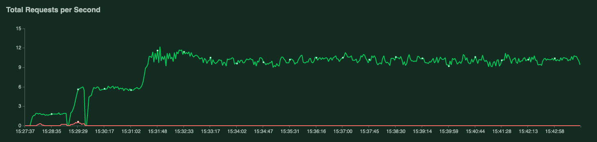

# Load testing

This directory contains [locust](https://locust.io) load testing tasks to load test the Global.health APIs.

Set-up and initial load testing was tracked in [this github issue](https://github.com/globaldothealth/list/issues/1263).

## TL;DR results

Dev starts to hit its CPU thresholdlimit ~10 QPS (simulated with ~20 users and a spawn rate of 1), while the RAM usage doesn't increase at all (50Mb->60Mb). Response latency increases to unreasonable levels when load on CPU is too high.

Latest load test results:

```text
 Name                                                          # reqs      # fails  |     Avg     Min     Max  Median  |   req/s failures/s
--------------------------------------------------------------------------------------------------------------------------------------------
 GET /api/cases                                                  5033     0(0.00%)  |     672     150    5042     450  |    6.01    0.00
 GET /api/sources                                                1032     0(0.00%)  |     573     141    3533     400  |    1.23    0.00
 GET /api/sources/uploads                                         998     0(0.00%)  |     553     139    3167     390  |    1.19    0.00
 GET /api/users                                                   514     0(0.00%)  |     601     140    3289     420  |    0.61    0.00
 GET /auth/profile                                                532     0(0.00%)  |     506     132    5066     330  |    0.64    0.00
--------------------------------------------------------------------------------------------------------------------------------------------
 Aggregated                                                      8109     0(0.00%)  |     630     132    5066     420  |    9.69    0.00

Response time percentiles (approximated)
 Type     Name                                                              50%    66%    75%    80%    90%    95%    98%    99%  99.9% 99.99%   100% # reqs
--------|------------------------------------------------------------|---------|------|------|------|------|------|------|------|------|------|------|------|
 GET      /api/cases                                                        450    660    830    960   1400   2000   3100   3500   3900   5000   5000   5033
 GET      /api/sources                                                      400    570    740    830   1200   1700   2600   3000   3400   3500   3500   1032
 GET      /api/sources/uploads                                              390    570    720    800   1100   1700   2500   2700   3200   3200   3200    998
 GET      /api/users                                                        420    600    740    870   1300   1900   2500   2700   3300   3300   3300    514
 GET      /auth/profile                                                     330    520    670    750   1100   1400   2100   2200   5100   5100   5100    532
--------|------------------------------------------------------------|---------|------|------|------|------|------|------|------|------|------|------|------|
 None     Aggregated                                                        420    630    780    900   1300   1900   2900   3300   3900   5100   5100   8109
 ```

_1601386056.png)




Data service resource usage at 10QPS did not increase significantly, CPU constraints seem to be on the curator service only.

So basically: read-only traffic doesn't impact RAM usage much, curator service bottlenet is its CPU limits.

## Initial setup

Install Python 3.8, locust and the necessary dependencies with:

```shell
python3.8 -m pip install -r requirements.txt
```

Get access to serialized credentials stored in S3 or generate your own and put them in an S3 bucket that you can access, then set the required environment variables when running locust:

```shell
S3_BUCKET='epid-ingestion' S3_OBJECT='covid-19-map-277002-0943eeb6776b.json'
```

You can check the [ingestion docs](/ingestion/functions/README.md) for how to generate/get those creds.

## Local load test

To load test a local instance, do:

```shell
python3 -m locust --locustfile locustfile.py --host http://localhost:3002 --users 10 --spawn-rate 1
```

Locally you can try using the [import scripts](/data-serving/scripts/data-pipeline/README.md) to import some data locally to make it more meaningful.

Note: When testing a local instance, make sure the user whose serialized credentials you are using has the curator and admin roles in the [local users administration page](http://localhost:3002/users).

### What to look for locally

Check the response time percentiles in the UI if they feel reasonable, the number of failures if any and overall memory usage of the docker containers using `docker stats`, the output should look something like:

```text
CONTAINER ID        NAME                CPU %               MEM USAGE / LIMIT     MEM %               NET I/O             BLOCK I/O           PIDS
59381efc5cbd        dev_curatorui_1     5.99%               730.8MiB / 1.944GiB   36.70%              1.86MB / 176kB      0B / 0B             42
4b107a29e174        dev_curator_1       2.78%               92.41MiB / 1.944GiB   4.64%               732kB / 647kB       0B / 0B             36
3df7fdac25b2        dev_data_1          1.54%               66.79MiB / 1.944GiB   3.35%               534kB / 493kB       0B / 0B             36
3adfc5cf8fab        dev_mongo_1         198.09%             489.4MiB / 1.944GiB   24.58%              121kB / 580kB       0B / 0B             44
```

## Dev load test

To load test dev, do:

```shell
python3 -m locust --locustfile locustfile.py --host https://dev-curator.ghdsi.org --users 10 --spawn-rate 1
```

Follow the link to the locust UI and start the load test there, you can tune the number of users and spawn-rate from the UI or from the command line (command like only sets the defaults used in the UI).

### What to look for in dev

Check the response time percentiles in the UI if they feel reasonable, the number of failures if any and memory/cpu usage of pods using `kubectl top pods`.

A more visual way of looking at dev resource usage would be the [kubernetes dashboard](/aws/README.md#Kubernetes-dashboard), searching for "dev" will help you filter out production pods.

## Prod load test

Please don't. Load test locally and in dev but avoid hitting prod with crazy load as we do currently not have a way of segregating traffic and shedding excessive load traffic that could impact real users.

## Known caveats

- These load tests talk to the API endpoint as they are not using a headless browser that could render Javascript and exercise the UI code directly, we don't expect the UI portion of the code to be the bottleneck though so just testing the API is good enough for now.
- Kubernetes horizontal auto-scaling is not enabled, it could but it would also make load-testing dependent on the current load of the cluster so it has to be taken into account if we ever enable it.
- Only a subset of readonly endpoints are tested, we could test mutating endpoints as well but most users shouldn't have mutate access so we're not worried about the load they would induce.
- Load tests talk to the curator service API, not to the data service API, this is because the curator service is the only endpoint exposed externally.
