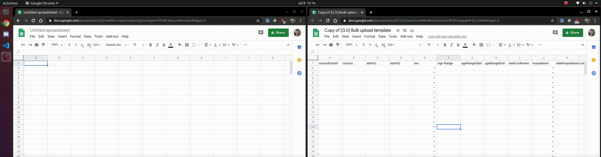

# Global.health Curator Portal UI

This directory contains the code for the UI of the Global Health Curator Portal accessible here:

- [dev](https://dev-curator.ghdsi.org)
- [prod](https://curator.ghdsi.org)
- [local dev](http://localhost:3002)

## Usage

All relevant usage information will ultimately be provided by the interface
itself. This section contains documentation that hasn't yet been incorporated
into the interface.

### Bulk upload process

#### Input data in the proper format

The current bulk upload process is _parserless_, and so for data to be properly
ingested it must be uploaded in a standard CSV format. A Google Sheets template
corresponding to this CSV format is available
[here](https://docs.google.com/spreadsheets/d/1J-C7dq1rNNV8KdE1IZ-hUR6lsz7AdlvQhx6DWp36bjE).
The following fields are currently incorporated:

##### Case reference
- `sourceEntryId`: Optional. The UUID provided by the data source to identify
the specific case.

##### Demographics
- `gender`: Optional. One of `Female`, `Male`, `Non-binary/Third gender`, or
`Other`.
- `ageRangeStart`: Optional. Number (years) from 0 to 120.
- `ageRangeEnd`: Optional. Number (years) from 0 to 120.
- `ageRange`: Optional. Convenience field accepting an age range in the format
`start-end`. If provided in this format, will be used in lieu of
`ageRangeStart` and `ageRangeEnd`.
- `ethnicity`: Optional.
- `nationalities`: Optional. Delimit multiple nationalities with a semicolon
(e.g., `British;Indian`).
- `occupation`: Optional.

##### Location
- `country`: **Required**. Country name text (e.g., "United States").
- `admin1`: Optional. Meaning differs by country (e.g., this is state in the
US).
[See full definition here](https://en.wikipedia.org/wiki/List_of_administrative_divisions_by_country).
- `admin2`: Optional. Meaning differs by country (e.g., this is county in the
US).
[See full definition here](https://en.wikipedia.org/wiki/List_of_administrative_divisions_by_country).
- `admin3`: Optional. Meaning differs by country (e.g., this is municipality in the
US).
[See full definition here](https://en.wikipedia.org/wiki/List_of_administrative_divisions_by_country).

##### Events
- `dateConfirmed`: **Required**. Date (YYYY/MM/DD) on which the case was
confirmed.
- `confirmationMethod`: Optional. Mechanism by which the case was confirmed
(e.g., `PCR test`).
- `hospitalized`: Optional. One of `true` or `false`.
- `dateHospitalized`: Optional. Date (YYYY/MM/DD) on which the patient was
hospitalized.
- `icuAdmission`: Optional. One of `true` or `false`.
- `dateIcuAdmission`: Optional. Date (YYYY/MM/DD) on which the patient was
admitted to the ICU.
- `outcome`: Optional. One of either `Death` or `Recovered`.
- `dateOutcome`: Optional. Date (YYYY/MM/DD) on which the above outcome
transpired.
- `dateSymptomOnset`: Optional. Date (YYYY/MM/DD) on which symptoms first
presented in the case.

##### Symptoms and preexisting conditions
- `symptomStatus`: Optional. One of `Symptomatic`, `Asymptomatic`, or
`Presymptomatic`.
- `symptoms`: Optional. Delimit multiple symptoms with a semicolon (e.g.,
`cough;fever`).
- `hasPreexistingConditions`: Optional. One of `true` or `false`.
- `preexistingConditions`: Optional. Delimit multiple symptoms with a semicolon
(e.g., `Lyme disease;COPD`).

##### Metadata
- `caseCount`: Optional. Number greater than 0. If provided, `caseCount` number
of cases will be inserted into the database: each containing identical values
for all other columns. Cannot be provided in combination with `sourceEntryId`.

Any valid CSV file with the above headers can be uploaded via the bulk upload
form. For convenience, users can make a copy of the aforementioned Google
Sheets template to generate a valid CSV, using roughly the following process:

As a more realistic example, consider the following process that a curator might
use in order to prepare data obtained from the Ohio state government website:

#### Additional notes

Some features to note:

- Bulk upload _upserts_ data. If a row is uploaded that contains a
`sourceEntryId` corresponding to an existing case in our database with the
selected source, the provided data will update the existing row. It will not
create duplicate row(s) with the same `sourceEntryId`. This enables easy
updating of sources that publish all cases together with UUIDs.
- Upload feedback is currently WIP. The existing feedback message, which is
dispalyed at the bottom of the form after uploading, reflects the status of the
final case in the CSV. If it was successful, the message will be `Success!`;
otherwise, it's likely to say that the request failed with `422`, which means
the data wasn't properly formatted. This is changing in the near future.

## Development

The React application was built with the `create-react-app` new project generator.

Prepare the variants of concern (VOC) data by running `npm run prepare-variants`. This step is included in `npm run build` so it's not necessary to do it yourself when preparing a production build.

Run the stack by executing the `/dev/run_stack.sh` script or simply launch the UI alone by running `npm start` from this directory. Note that all API calls are proxied to `localhost:3001` by default so running the full stack is probably a better idea than just running the UI unless you want to change something that isn't API relevant.

The proxy config can be found in the `src/setupProxy.js` file.

All react components can be found in the `src/components` directory and their tests as well.
To run the unit tests and re-run them each time a file is saved, run `npm test`.

In general **all components should have unit tests and proper coverage**. UI interactions between components are validated using integration tests described in the next section.

### Integration tests

We use https://www.cypress.io/ for our integration tests, you can open the cypress runner locally by running `npm run cypress-open` or simply run the tests in headless mode by running `npm run cypress-run`.

Integration tests tend to be slower and more flaky than unit tests so prefer writing plenty of unit tests first and then finish with integration tests.

## Available Scripts (from `create-react-app`)

In the project directory, you can run:

### `npm start`

Runs the app in the development mode. 
Open [http://localhost:3002](http://localhost:3002) to view it in the browser.

The page will reload if you make edits. 
You will also see any lint errors in the console.

### `npm test`

Launches the test runner in the interactive watch mode. 
See the section about [running tests](https://facebook.github.io/create-react-app/docs/running-tests) for more information.

### `npm run build`

Builds the app for production to the `build` folder. 
It correctly bundles React in production mode and optimizes the build for the best performance.

The build is minified and the filenames include the hashes. 
Your app is ready to be deployed!

See the section about [deployment](https://facebook.github.io/create-react-app/docs/deployment) for more information.

### `npm run eject`

**Note: this is a one-way operation. Once you `eject`, you can’t go back!**

If you aren’t satisfied with the build tool and configuration choices, you can `eject` at any time. This command will remove the single build dependency from your project.

Instead, it will copy all the configuration files and the transitive dependencies (webpack, Babel, ESLint, etc) right into your project so you have full control over them. All of the commands except `eject` will still work, but they will point to the copied scripts so you can tweak them. At this point you’re on your own.

You don’t have to ever use `eject`. The curated feature set is suitable for small and middle deployments, and you shouldn’t feel obligated to use this feature. However we understand that this tool wouldn’t be useful if you couldn’t customize it when you are ready for it.

## Learn More

You can learn more in the [Create React App documentation](https://facebook.github.io/create-react-app/docs/getting-started).

To learn React, check out the [React documentation](https://reactjs.org/).
